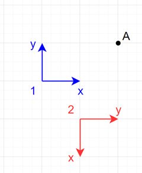

# Day 19 - Beacon Scanner

## Part One

### Context

There are **scanners** and **beacons**.

Each scanner can detect beacons in a cube centered on the scanner at most `1,000` units away in each of the three axes `x`, `y` and `z`.

By establishing at least `12` commons beacons to two scanners, you can determine where the scanners are relative to each other.

---

### Example in 2 dimensions

```text
--- scanner 0 ---
0,2
4,1
3,3

--- scanner 1 ---
-1,-1
-5,0
-2,1
```

```text
--- scanner 0 ---
...B.
B....
....B
S....

--- scanner 1 ---
...B..
B....S
....B.
```

In this simplified example suppose scanner only need `3` overlapping beacons.
So you can determine the relative position of the scanners: `scanner 1` is at position `(5,2)` relative to `scanner 0`.

```text
...B..
B....S
....B.
S.....
```
---

The scanners also don't know their facing direction.
Each axel can be rotated some integer number of 90-degree.
So there are `24` different orientations.

```text
 1)  x, y, z
 2)  x,-y,-z
 3)  x, z,-y
 4)  x,-z, y
 5) -x, z, y
 6) -x,-z,-y
 7) -x, y,-z
 8) -x,-y, z
 9)  y, z, x
10)  y,-z,-x
11)  y, x,-z
12)  y,-x, z
13) -y, x, z
14) -y,-x,-z
15) -y, z,-x
16) -y,-z, x
17)  z, x, y
18)  z,-x,-y
19)  z, y,-x
20)  z,-y, x
21) -z, y, x
22) -z,-y,-x
23) -z, x,-y
24) -z,-x, y
```

### Problem

Find `12` matching beacons between two scanners after a transformation, which consists of a translation of the origin and one of the 24 possible rotations.

### Analysis

In the following diagram in two dimensions there are two **coordinate system** numbered as $1$ in blue and $2$ in red.
Each coordinate system represents a different scanner.



We initially don't know the relative location of these two scanners.
Instead of that we have the information that scanner 1 detects a beacon at position $A_1 = (2, 1)$ and scanner 2 detects a beacon at position $A_2 = (-2, 1)$.

We suppose that this beacon is the same and we name it $A$.
We also suppose that the scanner 2 is rotated from scanner 1 using the rotation:

$$
R = (-y, x) =
\left(\begin{array}{cc} 
0 & -1\\ 
1 & 0
\end{array}\right)
$$

The point seen from scanner 2 rotated and aligned as scanner 1 is:

$$
A_2 \times R = (-2, 1) \times 
\left(\begin{array}{cc} 
0 & -1\\ 
1 & 0
\end{array}\right)
= (1, 2)
$$

So we can compute the location of scanner 1 from scanner 2 after the rotation.

$$
T = (A_2 \times R) - A_1 = (1, 2) - (2, 1) = (-1, 1)
$$

To convert each beacon $P_2$ from scanner 2 to scanner 1 we have to apply the following transformation consisted in a rotation and a translation:

$$
P_1 = (P_2 \times R) - T
$$

### Solution

The basic idea is to take two arbitrary beacons (points) from two different scanners (coordinate systems) and one arbitrary rotation between the 24 possible.
Then, suppose that the two beacons are the same, and compute the translation between the scanners for this to happen.
Once we have the transformation that applied to the point seen from scanner 2 results in the point seen from scanner 1, we test this transformation with the rest of the beacons of scanner 2.
If we find that at least 12 beacons match, we have found the pose of scanner 2 relative to scanner 1.

If we cannot find 12 overlapping, we have to test with other rotation and then with other pair of beacons, until we find the correct transformation.

### Execute

```shell
mvn package
java -jar target/day-19-1.0-SNAPSHOT.jar -p one -i path/to/input/file -v
```

---

## Part Two

### Problem

Find the largest Manhattan distance between any two scanners.

### Execute

```shell
mvn package
java -jar target/day-19-1.0-SNAPSHOT.jar -p two -i path/to/input/file
```
