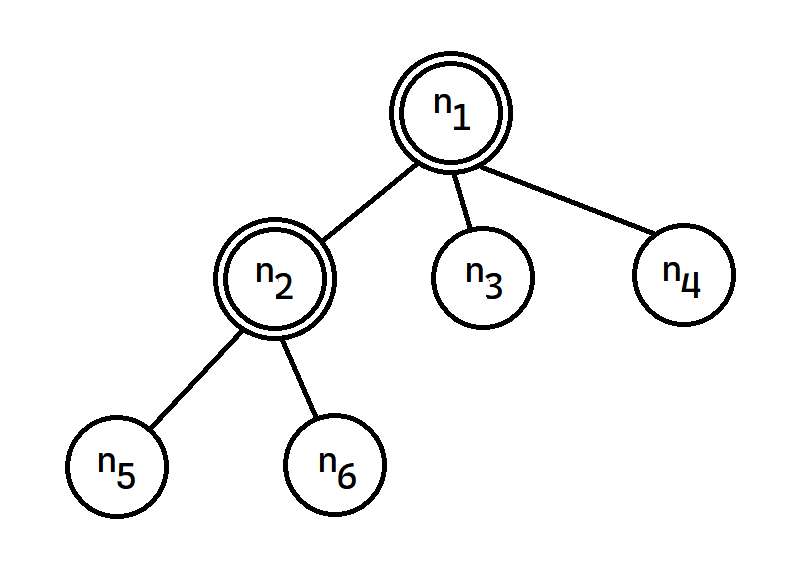

# Search Algorithm



The root node is the **initial state**.

We can expand the node by considering the available **actions** for that state.

We must choose which of the tree nodes to considere next, which is the essence of the search.

We say that each state that has a node generated is a **reached** node: $n_1, n_2, n_3, n_4, n_5, n_6$.

Then, we have the **expanded nodes** (a.k.a. closed list): $n_1, n_2$.

And the reached nodes not yet expanded are called the **frontier nodes** (a.k.a. open list): $n_3, n_4, n_5, n_6$.

## Best-first search

We choose a node $n$ with minimum value of some evaluation function $f(n)$.

On each iteration we choose a node on the frontier with minimum $f(n)$ value, return it if its state is a goal state, and otherwise apply **expand** to generate child nodes.

Each child node is added to the frontier if it has not been reached before, or is re-added if it is now being reached with a path that has a lower path cost than any previous path.

The algorithm returns either an indication of failure, or a node that represents a path to a goal.

## Data structure

A node in the tree is represented by a data structure with four components:

1. node.STATE: the state to which the node corresponds;
2. node.PARENT: the node in the tree that generated this node;
3. node.ACTION: the action that was applied to the parent’s state to generate this node;
4. node.PATH-COST: the total cost of the path from the initial state to this node. In mathematical formulas, we use $g(node)$ as a synonym for PATH-COST.

Following the PARENT pointers back from a node allows us to recover the states and actions along the path to that node.

Doing this from a goal node gives us the solution.

We need a data structure to store the **frontier**.

The appropriate choice is a queue of some kind, because the operations on a frontier are:

* IS-EMPTY(frontier) returns true only if there are no nodes in the frontier.
* POP(frontier) removes the top node from the frontier and returns it.
* TOP(frontier) returns (but does not remove) the top node of the frontier.
* ADD(node, frontier) inserts node into its proper place in the queue.

Three kinds of queues are used in search algorithms:

* A **priority queue** first pops the node with the minimum cost according to some evaluation function, $f$. It is used in best-first search.
* A **FIFO** queue or first-in-first-out queue first pops the node that was added to the queue first; we shall see it is used in breadth-first search.
* A **LIFO** queue or last-in-first-out queue (also known as a stack) pops first the most recently added node; we shall see it is used in depth-first search.

The reached states can be stored as a lookup table (e.g. a hash table) where each key is a state and each value is the node for that state.

## Uninformed search strategy

An uninformed search algorithm is given no clue about how close a state is to the goal.

### Breadth-first search

When all actions have the same cost, an appropriate strategy is **breadth-first search**, in which the root node is expanded first, then all the successors of the root node are expanded next, then their successors, and so on.

A FIFO queue will give us the correct order of nodes: new nodes (which are always deeper than their parents) go to the back of the queue, and old nodes, which are shallower than the new nodes, get expanded first.

Breadth-first search always finds a solution with a minimal number of actions, because when it is generating nodes at depth $d$, it has already generated all the nodes at depth $d − 1$, so if one of them were a solution, it would have been found.

That means it is cost-optimal for problems where all actions have the same cost, but not for problems that don’t have that property.

### Dijkstra's algorithm (uniform-cost search)

The idea is that while breadth-first search spreads out in waves of uni-
form depth —first depth 1, then depth 2, and so on— uniform-cost search spreads out in waves of uniform path-cost.

The algorithm can be implemented as a call to BEST-FIRST-SEARCH with PATH-COST as the evaluation function.

### Depth-first search

Depth-first search always expands the deepest node in the frontier first.

It could be implemented as a call to BEST-FIRST-SEARCH where the evaluation function $f$ is the negative of the depth.

However, it is usually implemented not as a graph search but as a tree-like search that does not keep a table of reached states.

Search proceeds immediately to the deepest level of the search tree, where the nodes have no successors, then “backs up” to the next deepest node that still has unexpanded successors.

Depth-first search is not cost-optimal; it returns the first solution it
finds, even if it is not cheapest.

A variant of depth-first search called **backtracking search** uses even less memory.

In backtracking, only one successor is generated at a time rather than all successors; each partially expanded node remembers which successor to generate next.

In addition, successors are generated by modifying the current state description directly rather than allocating memory for a brand-new state.

For backtracking to work, we must be able to undo each action when we backtrack.

### Bidirectional search

The algorithms seen so far start at an initial state and can reach any one of multiple possible goal states.

An alternative approach called bidirectional search simultaneously searches forward from the initial state and backwards from the goal state (or states), hoping that the two searches will meet.

The motivation is that $b^{d/2} + b^{d/2}$ is much less than $b^d$.

## Informed (heuristic) search strategy

The hints come in the form of a heuristic function, denoted $h(n)$, estimated cost of the cheapest path from the state at node $n$ to a goal state.

### Greedy best-first search

Expands first the node with the lowest $h(n)$ value —the node that appears to be closest to the goal— on the grounds that this is likely to lead to a solution quickly.

However, the solution it found may not have optimal cost.

### A* search

It is a best-first search that uses the evaluation function:

$f(n) = g(n) + h(n)$,

where $g(n)$ is the path cost from the initial state to node $n$, and $h(n)$ is the estimated cost of the shortest path from $n$ to a goal state, so we have:

$f(n)$: estimated cost of the best path that continues from $n$ to a goal.

Whether A∗ is cost-optimal depends on certain properties of the heuristic.

A key property is **admissibility**: an admissible heuristic is one that never overestimates the cost to reach a goal.
(An admissible heuristic is therefore optimistic.)

With an admissible heuristic, A∗ is cost-optimal

A slightly stronger property is called **consistency**.

A heuristic $h(n)$ is consistent if, for every node $n$ and every successor $n′$ generated by an action $a$, we have:

$h(n) \leq c(n,a,n′) + h(n′)$.

Every consistent heuristic is admissible (but not vice versa), so with a consistent heuristic, A∗ is cost-optimal.

In addition, with a consistent heuristic, the first time we reach a state it will be on an optimal path, so we never have to re-add a state to the frontier, and never have to change an entry in reached.

But with an inconsistent heuristic, we may end up with multiple paths reaching the same state, and if each new path has a lower path cost than the previous one, then we will end up with multiple nodes for that state in the frontier, costing us both time and space.

---

## Best-first search algorithm

```
function BEST-FIRST-SEARCH(problem, f)
    node <- NODE(STATE=problem.INITIAL)
    frontier <- a priority queue of nodes ordered by f
    reached <- a lookup table STATE->NODE, with one entry problem.INITIAL and value node
    while not IS-EMPTY(frontier) do
        node <- POP(frontier)
        if problem.IS-GOAL(node.STATE) then return node
        for each child in EXPAND(problem, node) do
            s <- child.STATE
            if s is not in reached or child.PATH-COST < reached[s].PATH-COST then
                reached[s] <- child
                add child to frontier
    return failure
```

```
function EXPAND(problem, node)
    s <- node.STATE
    for each action in problem.ACTIONS(s) do
        s′ <- problem.RESULT(s, action)
        cost <- node.PATH-COST + problem.ACTION-COST(s, action, s′)
        yield NODE(STATE=s′, PARENT=node, ACTION=action, PATH-COST=cost)
```

---
Source: Artificial Intelligence: A Modern Approach (Chapter 3)